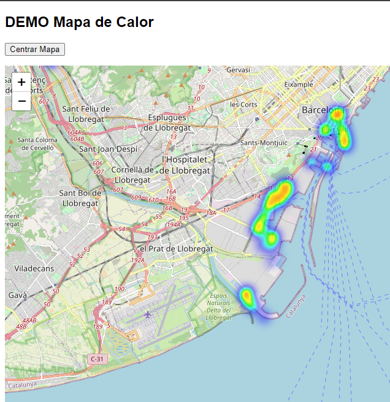

# Mapa Calor DEMO

## Backend setup
```terminal
$ cd backend
$ npm install
$ node servicio.js
```

API endpoint: 
http://localhost:3000/csv


## Frontend
```terminal
$ npm install -g http-server
$ http-server -p 5000 --cors
```

Start heatmap demo: 
http://localhost:5000


